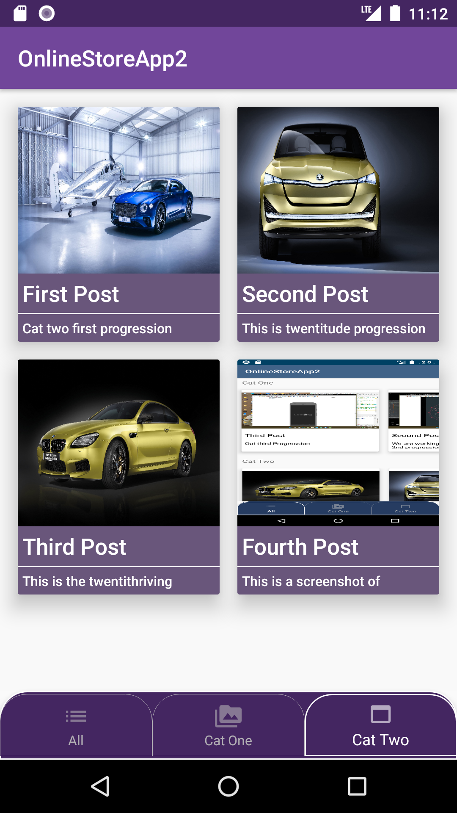

# OnlineStoreApp2
Online Store App using firbase realtime db
  

**SCREENSHOTS OF THE UI APP:**
 
<h4 align="center">All Catalogue UI screenshot</h4>

     

   

<h4 align="center">Catalogue One UI screenshot</h4>

    

   

<h4 align="center">Second Catalogue UI screenshot</h4>

   

<h4 align="center">Item Details UI screenshot</h4>

   

   
